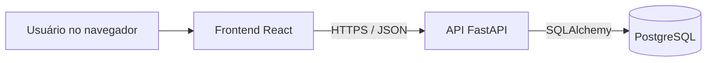
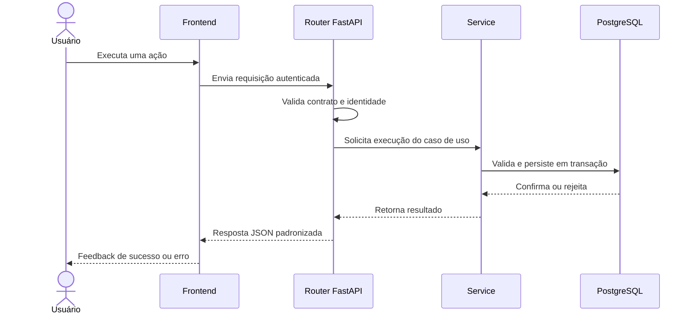

# Arquitetura do Sistema — Sis Estoque

## Controle do documento

- **Status:** Aprovado para orientar a Meta 2
- **Escopo:** MVP descrito em `Product-Vision.md`
- **Abordagem:** Specification-Driven Development (SDD)
- **Princípios:** simplicidade, legibilidade, segurança, responsabilidade única,
  DRY, YAGNI e alteração mínima

Este documento descreve a arquitetura proposta. Ele não autoriza a
implementação. Mudanças arquiteturais, dependências, banco, autenticação e
deploy exigem plano e aprovação explícita conforme `AGENTS.md`.

## 1. Objetivos arquiteturais

A arquitetura deve:

- sustentar os casos de uso do MVP sem antecipar funcionalidades futuras;
- garantir que toda mudança de saldo seja rastreável por uma movimentação;
- separar interface, regras de aplicação e persistência de forma legível;
- permitir testes automatizados das regras críticas;
- funcionar adequadamente em desktop, tablet e celular;
- manter segredos fora do código e dos logs;
- ser simples para execução local e apresentação como projeto de portfólio.

## 2. Stack oficial

| Área | Tecnologias |
|---|---|
| Frontend | React, TypeScript e Vite |
| Backend | Python e FastAPI |
| Persistência | PostgreSQL e SQLAlchemy |
| Versionamento | Git e GitHub |
| Deploy | Docker, introduzido somente na fase de deploy |

Bibliotecas adicionais só poderão ser adotadas quando necessárias, registradas
no plano da fase e aprovadas. Docker não será requisito para o desenvolvimento
local inicial.

## 3. Estilo arquitetural

O Sis Estoque será uma aplicação web cliente-servidor composta por:

1. uma SPA React executada no navegador;
2. uma API REST construída com FastAPI;
3. um banco relacional PostgreSQL acessado pela API com SQLAlchemy.

O backend será um **monólito modular**. Essa escolha mantém implantação,
depuração e transações simples para o tamanho do MVP. Microsserviços, filas,
cache distribuído, event sourcing e outras infraestruturas não fazem parte da
arquitetura atual.



## 4. Responsabilidades dos componentes

### 4.1 Frontend

O frontend é responsável por:

- apresentar telas, formulários, tabelas, filtros e indicadores;
- validar formato e obrigatoriedade para feedback imediato;
- controlar navegação e estado visual;
- consumir a API e apresentar estados de carregamento, vazio e erro;
- ocultar ações incompatíveis com o perfil como melhoria de experiência.

O frontend não é fonte de verdade para saldo, permissões ou regras de negócio.
Toda validação relevante será repetida e garantida pelo backend.

Organização proposta por funcionalidade:

```text
frontend/
  src/
    app/                 # inicialização, rotas e providers
    components/          # componentes compartilhados
    features/
      auth/
      categories/
      products/
      suppliers/
      movements/
      dashboard/
    services/            # cliente HTTP e integrações
    styles/              # estilos globais e tokens visuais
    types/               # tipos realmente compartilhados
    utils/               # utilitários sem regra de negócio
```

Componentes específicos devem permanecer dentro da funcionalidade. Um elemento
só deve ser movido para `components` quando houver reutilização comprovada.

### 4.2 Backend

O backend é responsável por:

- autenticar usuários e autorizar operações;
- validar regras de negócio;
- controlar transações de estoque;
- persistir e consultar dados;
- oferecer contratos REST estáveis para o frontend;
- produzir erros claros sem expor detalhes sensíveis;
- manter rastreabilidade das movimentações.

Estrutura proposta:

```text
backend/
  app/
    main.py              # criação e configuração da aplicação
    api/
      dependencies.py    # dependências compartilhadas da API
      routers/           # endpoints agrupados por recurso
    core/
      config.py          # configuração por ambiente
      security.py        # autenticação, senha e autorização
    db/
      base.py            # registro dos modelos
      session.py         # sessão e conexão
    models/              # modelos SQLAlchemy
    schemas/             # contratos de entrada e saída
    services/            # casos de uso e regras de aplicação
    tests/
  migrations/            # histórico de evolução do banco
```

Os routers traduzem HTTP para chamadas de serviço. Os services coordenam regras
e transações. Os models representam persistência. Não será criada uma camada de
repositório genérica sem necessidade comprovada.

### 4.3 Banco de dados

O PostgreSQL é a fonte oficial dos dados persistidos. O banco deverá reforçar
invariantes por meio de chaves, unicidade, nulabilidade e constraints sempre
que isso não duplicar regras de forma contraditória.

Evoluções de schema serão versionadas por migrations. Uma migration não deverá
ser editada depois de aplicada em ambiente compartilhado; uma correção deverá
ser feita por uma nova migration.

## 5. Módulos do domínio

| Módulo | Responsabilidade |
|---|---|
| Autenticação e usuários | Identidade, sessão e perfis de acesso |
| Categorias | Organização do catálogo |
| Produtos | Dados do item, SKU e estoque mínimo |
| Fornecedores | Cadastro e vínculo com produtos |
| Movimentações | Entradas, saídas, ajustes e atualização do saldo |
| Consultas e dashboard | Histórico, alertas e indicadores consolidados |

Os módulos fazem parte do mesmo processo e banco. A separação é lógica, não uma
distribuição física.

## 6. Fluxo de uma requisição



## 7. Consistência de estoque

Movimentação e saldo serão atualizados na mesma transação. O fluxo deverá:

1. identificar o produto e bloquear seu saldo para atualização concorrente;
2. validar produto ativo, tipo, quantidade e permissão;
3. validar saldo disponível quando houver redução;
4. registrar a movimentação com saldo anterior e resultante;
5. atualizar o saldo corrente;
6. confirmar as duas alterações juntas ou desfazer ambas.

Não haverá endpoint que altere diretamente o saldo sem gerar movimentação. O
histórico de movimentações não poderá ser editado ou apagado pela aplicação.
Correções serão feitas por uma nova movimentação de ajuste.

## 8. Contrato da API

A API utilizará JSON sobre HTTP e terá versionamento inicial `/api/v1`.

Convenções propostas:

- substantivos no plural para recursos;
- métodos HTTP conforme a operação;
- códigos HTTP coerentes com sucesso, validação, autenticação e conflito;
- paginação em listagens potencialmente grandes;
- filtros explícitos por query string;
- datas e horários no padrão ISO 8601 e armazenados em UTC;
- identificador de campo e mensagem legível em erros de validação;
- documentação OpenAPI fornecida pelo FastAPI.

Formato conceitual de erro:

```json
{
  "code": "INSUFFICIENT_STOCK",
  "message": "Saldo insuficiente para concluir a saída.",
  "details": []
}
```

Mensagens internas, stack traces, consultas SQL e segredos não serão retornados
ao cliente.

## 9. Autenticação e autorização

O MVP considera três perfis:

- **Administrador:** administra usuários e possui acesso integral;
- **Gestor:** consulta indicadores e administra cadastros e movimentações;
- **Operador:** consulta dados e registra movimentações permitidas.

As permissões definitivas estão em `Business-Rules.md`. Senhas serão armazenadas
somente como hash seguro. Credenciais, chaves e configurações sensíveis virão de
variáveis de ambiente. A autorização será aplicada no backend em cada operação
protegida, independentemente do que a interface exibir.

O mecanismo exato de sessão ou token será escolhido no plano de implementação
da autenticação, com análise específica de segurança e aprovação.

## 10. Configuração e ambientes

Ambientes previstos:

- **Desenvolvimento:** frontend, backend e PostgreSQL executados localmente;
- **Teste:** banco isolado e configuração própria para testes automatizados;
- **Produção/demonstração:** componentes empacotados com Docker na fase de
  deploy.

O repositório poderá conter `.env.example` apenas com nomes e valores seguros de
exemplo. Arquivos `.env` reais e credenciais não serão versionados.

## 11. Estratégia de testes

- **Frontend:** componentes e fluxos relevantes, validação e estados de tela;
- **Backend:** regras de negócio e autorização em testes unitários;
- **Integração:** API, transações e persistência com banco isolado;
- **Ponta a ponta:** apenas fluxos críticos do MVP;
- **Build e análise estática:** TypeScript, lint, formatação e verificações do
  Python.

As ferramentas específicas serão propostas e aprovadas na fase de fundação.
Testes não substituirão constraints e validações necessárias no banco e na API.

## 12. Observabilidade e tratamento de erros

O backend produzirá logs estruturados suficientes para diagnóstico, contendo
contexto técnico e identificador da requisição quando definido. Senhas, tokens,
conteúdo de credenciais e outros dados sensíveis nunca serão registrados.

Erros esperados serão traduzidos para respostas de domínio claras. Erros
inesperados serão registrados e retornarão mensagem genérica ao cliente.

## 13. Deploy

Docker será introduzido apenas na fase de deploy. O empacotamento deverá cobrir,
no mínimo, frontend e backend; a estratégia para o PostgreSQL dependerá do
ambiente escolhido. Hospedagem, domínio, HTTPS, backup, custos e gerenciamento
de segredos serão objeto de plano separado e aprovação específica.

## 14. Decisões adiadas

As seguintes escolhas serão feitas somente quando a fase correspondente for
planejada:

- biblioteca de componentes e estratégia de estilos;
- biblioteca de formulários e acesso a dados no frontend;
- ferramentas exatas de lint, formatação e testes;
- mecanismo de autenticação e duração de sessão;
- provedor e topologia de deploy;
- monitoramento externo e política operacional de backup.

Adiar essas decisões evita dependências prematuras sem bloquear a especificação
do domínio.

## 15. Restrições

Não fazem parte desta arquitetura do MVP:

- microsserviços;
- aplicativo móvel nativo;
- integrações externas e marketplaces;
- emissão fiscal;
- módulos financeiro, contábil ou de folha;
- previsão de demanda por inteligência artificial;
- infraestrutura distribuída sem necessidade comprovada.

## 16. Critério de aprovação

Este documento está aprovado para orientar a Meta 2. Os responsáveis
confirmaram:

- stack e estilo arquitetural;
- módulos e responsabilidades;
- estratégia transacional do estoque;
- inclusão de autenticação e perfis;
- separação entre desenvolvimento local e Docker no deploy.

Qualquer mudança material posterior deverá atualizar este documento e seguir um
novo ciclo de análise, plano, aprovação, implementação e verificação.
