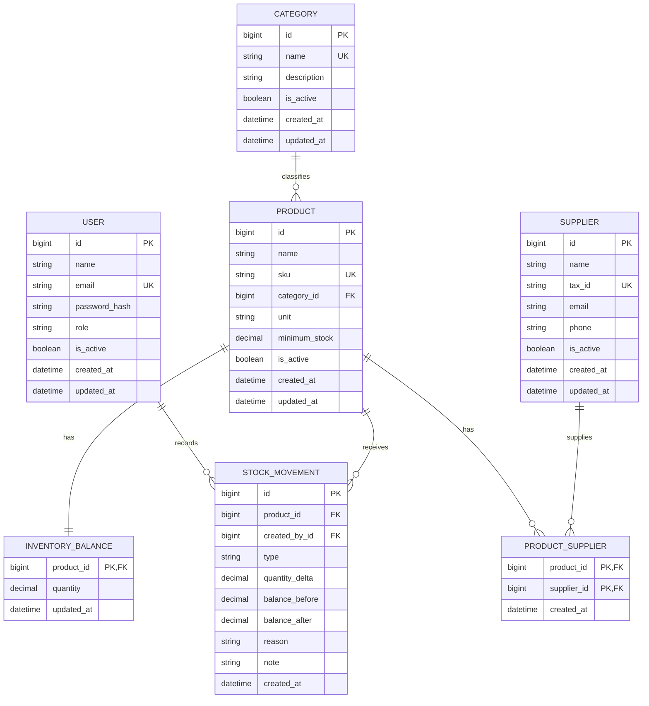

# Modelo de Dados — Sis Estoque

## Controle do documento

- **Status:** Aprovado para orientar a Meta 2
- **Nível:** Modelo lógico do MVP
- **Tecnologias:** PostgreSQL e SQLAlchemy
- **Regras relacionadas:** `Business-Rules.md`

Este documento define o modelo lógico proposto. Nomes físicos, tipos exatos e
migrations serão confirmados no plano de implementação do banco. Nenhuma
migration está autorizada por este documento.

## 1. Princípios do modelo

- PostgreSQL é a fonte oficial dos dados persistidos.
- Toda alteração de saldo possui uma movimentação correspondente.
- Saldo e movimentação são atualizados na mesma transação.
- Dados necessários à rastreabilidade não são excluídos fisicamente.
- Constraints do banco reforçam invariantes críticas.
- Datas e horários são armazenados em UTC.
- O modelo contém apenas dados necessários aos casos de uso aprovados.

## 2. Diagrama conceitual

## 3. Entidades

### 3.1 Usuário (`users`)

Representa a identidade que acessa o sistema.

| Campo | Obrigatório | Regra |
|---|:---:|---|
| `id` | Sim | Identificador gerado pelo banco |
| `name` | Sim | Nome de exibição |
| `email` | Sim | Normalizado e único sem diferença de caixa |
| `password_hash` | Sim | Hash seguro; nunca senha em texto puro |
| `role` | Sim | `ADMIN`, `MANAGER` ou `OPERATOR` |
| `is_active` | Sim | Controla acesso sem apagar histórico |
| `created_at` | Sim | Data/hora de criação em UTC |
| `updated_at` | Sim | Data/hora da última alteração em UTC |

Restrições:

- índice único para o e-mail normalizado;
- `role` limitado aos valores aprovados;
- usuário referenciado por movimentação não pode ser excluído fisicamente.

### 3.2 Categoria (`categories`)

Organiza produtos para consulta.

| Campo | Obrigatório | Regra |
|---|:---:|---|
| `id` | Sim | Identificador gerado pelo banco |
| `name` | Sim | Nome normalizado e único |
| `description` | Não | Descrição curta |
| `is_active` | Sim | Permite inativação sem perda de vínculo |
| `created_at` | Sim | Data/hora de criação em UTC |
| `updated_at` | Sim | Data/hora da última alteração em UTC |

### 3.3 Produto (`products`)

Representa o item controlado no estoque. O saldo fica separado em
`inventory_balances` para explicitar a responsabilidade transacional.

| Campo | Obrigatório | Regra |
|---|:---:|---|
| `id` | Sim | Identificador gerado pelo banco |
| `name` | Sim | Nome do produto |
| `sku` | Sim | Código normalizado e único |
| `category_id` | Sim | Referência a uma categoria |
| `unit` | Sim | Unidade do MVP: `UN`, `CX`, `KG`, `G`, `L`, `ML`, `M` ou `CM` |
| `minimum_stock` | Sim | Valor maior ou igual a zero |
| `is_active` | Sim | Produto inativo não recebe movimentações |
| `created_at` | Sim | Data/hora de criação em UTC |
| `updated_at` | Sim | Data/hora da última alteração em UTC |

Restrições:

- índice único para SKU normalizado;
- chave estrangeira obrigatória para categoria;
- constraint `minimum_stock >= 0`;
- a aplicação valida que a categoria esteja ativa ao cadastrar ou alterar.

### 3.4 Saldo (`inventory_balances`)

Mantém o saldo corrente para consultas operacionais e bloqueio transacional.

| Campo | Obrigatório | Regra |
|---|:---:|---|
| `product_id` | Sim | Chave primária e estrangeira para produto |
| `quantity` | Sim | Saldo atual, nunca negativo |
| `updated_at` | Sim | Momento da última alteração em UTC |

Um saldo com quantidade zero é criado junto com o produto. Campos de quantidade,
estoque mínimo e movimentação usam decimal com precisão de 12 dígitos e 3 casas
decimais. A constraint deve garantir `quantity >= 0`.

### 3.5 Fornecedor (`suppliers`)

Representa uma origem possível para os produtos.

| Campo | Obrigatório | Regra |
|---|:---:|---|
| `id` | Sim | Identificador gerado pelo banco |
| `name` | Sim | Nome ou razão social |
| `tax_id` | Não | CPF ou CNPJ normalizado e único quando informado |
| `email` | Não | E-mail de contato validado |
| `phone` | Não | Telefone de contato normalizado |
| `is_active` | Sim | Impede novos vínculos quando inativo |
| `created_at` | Sim | Data/hora de criação em UTC |
| `updated_at` | Sim | Data/hora da última alteração em UTC |

`tax_id`, `email` e `phone` são opcionais. Quando `tax_id` for informado, a
aplicação valida CPF ou CNPJ antes de persistir.

### 3.6 Produto–Fornecedor (`product_suppliers`)

Representa a relação muitos-para-muitos entre produtos e fornecedores.

| Campo | Obrigatório | Regra |
|---|:---:|---|
| `product_id` | Sim | Parte da chave composta e referência a produto |
| `supplier_id` | Sim | Parte da chave composta e referência a fornecedor |
| `created_at` | Sim | Data/hora do vínculo em UTC |

A chave composta impede vínculos duplicados. A remoção do vínculo não remove o
produto nem o fornecedor.

### 3.7 Movimentação de estoque (`stock_movements`)

É o registro imutável que explica toda alteração de saldo.

| Campo | Obrigatório | Regra |
|---|:---:|---|
| `id` | Sim | Identificador gerado pelo banco |
| `product_id` | Sim | Produto movimentado |
| `created_by_id` | Sim | Usuário responsável |
| `type` | Sim | `ENTRY`, `EXIT` ou `ADJUSTMENT` |
| `quantity_delta` | Sim | Variação diferente de zero |
| `balance_before` | Sim | Saldo imediatamente anterior |
| `balance_after` | Sim | Saldo após a movimentação |
| `reason` | Condicional | Obrigatório para ajuste |
| `note` | Não | Observação operacional curta |
| `created_at` | Sim | Data/hora atribuída pelo servidor em UTC |

Restrições:

- `quantity_delta <> 0`;
- `balance_before >= 0` e `balance_after >= 0`;
- entrada exige variação positiva;
- saída exige variação negativa;
- ajuste aceita variação positiva ou negativa;
- `balance_after = balance_before + quantity_delta`;
- tipo limitado aos três valores do MVP;
- registros não possuem operação de atualização ou exclusão na API.

## 4. Relacionamentos e cardinalidades

- Uma categoria possui zero ou muitos produtos; um produto possui uma
  categoria.
- Um produto possui exatamente um saldo corrente.
- Um produto possui zero ou muitas movimentações.
- Um usuário registra zero ou muitas movimentações.
- Produtos e fornecedores se relacionam de muitos para muitos.

Inativação não quebra relacionamentos históricos.

## 5. Transação de movimentação

Cada entrada, saída ou ajuste executará conceitualmente:

1. início da transação;
2. leitura do saldo do produto com bloqueio para atualização;
3. validação de produto, permissão, quantidade e saldo resultante;
4. inserção da movimentação;
5. atualização do saldo;
6. commit.

Qualquer falha causa rollback. Essa sequência implementa RN-016, RN-022 e
RN-023.

## 6. Índices iniciais

Índices mínimos propostos:

- `users(normalized_email)` único;
- `categories(normalized_name)` único;
- `products(normalized_sku)` único;
- `products(category_id, is_active)`;
- `suppliers(normalized_tax_id)` único quando aplicável;
- `stock_movements(product_id, created_at)`;
- `stock_movements(type, created_at)`;
- `stock_movements(created_by_id, created_at)`.

Índices adicionais exigem consultas reais ou medição. Não serão criados por
antecipação.

## 7. Exclusão e retenção

- Usuários, categorias, produtos e fornecedores com referências são inativados.
- Movimentações não são editadas ou apagadas pela aplicação.
- Vínculos produto–fornecedor podem ser removidos sem apagar as entidades.
- Política de retenção e anonimização, se necessária, será definida antes do
  deploy com base nos dados efetivamente coletados.

## 8. Migrations e dados iniciais

- Toda alteração de schema é versionada por migration.
- A aplicação não altera schema automaticamente ao iniciar em produção.
- Dados de demonstração são separados de migrations estruturais.
- Usuário administrador inicial não terá senha fixa no repositório.
- Rollback e impacto sobre dados serão analisados em cada migration.

## 9. Decisões aprovadas

| ID | Decisão | Impacto |
|---|---|---|
| DN-001 | Quantidades, estoque mínimo e movimentações usam decimal com precisão de 12 dígitos e 3 casas decimais. | Tipos de saldo, mínimo e movimentação |
| DN-002 | Unidades aceitas: `UN`, `CX`, `KG`, `G`, `L`, `ML`, `M` e `CM`. | Campo `products.unit` e validação |
| DN-003 | Fornecedor exige `name`; `tax_id`, `email` e `phone` são opcionais. `tax_id` aceita CPF ou CNPJ válido e único quando informado. | Schema definitivo de `suppliers` |
| DN-006 | Limites textuais: nome 120, e-mail 254, SKU 64, unidade 10, descrição/observação/justificativa 500, telefone 30 e documento fiscal normalizado 20. | Tipos `varchar`, validação e contratos |

## 10. Critério de aprovação

O modelo está aprovado para orientar a Meta 2. A migration inicial deverá ser
revisada contra este documento antes de ser aplicada.
