# Plano de Execução — Sis Estoque

## Controle do documento

- **Status:** Meta 10 concluida; pronto para planejar a Meta 11
- **Objetivo:** orientar a execução do MVP por metas verificáveis
- **Método:** Specification-Driven Development (SDD)

Este plano define sequência e critérios de conclusão. Ele não concede aprovação
automática para todas as fases. Cada fase seguirá o ciclo obrigatório de
compreender, esclarecer, planejar, aguardar aprovação, executar, verificar e
relatar.

## 1. Stack fixa

- **Frontend:** React + TypeScript + Vite
- **Backend:** Python + FastAPI
- **Banco:** PostgreSQL + SQLAlchemy
- **Versionamento:** Git + GitHub
- **Deploy:** Docker, introduzido somente na fase de deploy

Substituições e novas dependências de produção exigem análise e aprovação. O
desenvolvimento local inicial não dependerá de Docker.

## 2. Forma de trabalho

Antes de executar cada meta:

1. confirmar a especificação e os critérios de aceitação aplicáveis;
2. apresentar o plano detalhado da mudança, arquivos, comandos, riscos e testes;
3. identificar dependências ou ações externas;
4. aguardar aprovação explícita posterior ao plano;
5. implementar somente o escopo aprovado;
6. executar as verificações autorizadas;
7. relatar resultados, limitações e pendências.

Mudanças de arquitetura, dependências, banco, autenticação, GitHub, deploy,
publicação, push e merge devem aparecer expressamente no plano aprovado da
fase. Uma descoberta que altere materialmente o plano exige nova aprovação.

## 3. Estratégia de entrega

Após a fundação, o produto será construído em **fatias verticais**. Cada fatia
inclui interface, contrato da API, regra, persistência e testes relacionados.
Isso permite validar cedo o comportamento real e reduz uma integração tardia
entre um frontend e um backend desenvolvidos separadamente.

```mermaid
flowchart LR
    M1["1. Especificação"] --> M2["2. Ambiente e Git"]
    M2 --> M3["3. Fundação técnica"]
    M3 --> M4["4. Experiência-base"]
    M4 --> M5["5. Acesso"]
    M5 --> M6["6. Produtos"]
    M6 --> M7["7. Fornecedores"]
    M7 --> M8["8. Movimentações"]
    M8 --> M9["9. Visibilidade"]
    M9 --> M10["10. Qualidade"]
    M10 --> M11["11. Deploy"]
```

## 4. Metas

### Meta 1 — Especificação aprovada

**Objetivo:** transformar a visão em comportamento e decisões verificáveis.

**Entregáveis:**

- `Architecture.md`;
- `Use-Cases.md`;
- `Business-Rules.md`;
- `Data-Model.md`;
- `Non-Functional-Requirements.md`;
- `Execution-Plan.md`.

**Atividades concluídas em 20/07/2026:**

- documentos revisados em conjunto;
- DN-001 a DN-006 resolvidas;
- matriz de permissões confirmada;
- campos e fluxos do MVP confirmados;
- documentos afetados atualizados;
- especificação consolidada aprovada.

**Critério de conclusão:** concluído. Os documentos estão consistentes e
aprovados, sem decisão pendente que bloqueie o setup ou a primeira fatia
funcional.

### Meta 2 — Ambiente e repositório preparados

**Objetivo:** permitir instalação e execução reproduzíveis.

**Diagnóstico inicial em 20/07/2026:**

- Git, Node e npm encontrados;
- Python, PostgreSQL e Docker não encontrados no PATH no diagnóstico inicial;
- diretórios `frontend` e `backend` vazios;
- pasta `.git` existente, mas sem repositório Git válido.

**Atividades concluídas em 20/07/2026:**

- repositório Git inicializado após correção da permissão da pasta `.git`;
- `.gitignore`, `.editorconfig`, `.env.example` e `README.md` raiz criados;
- Python 3.13.14 instalado e verificado com `pip`;
- PostgreSQL 17.6 instalado em `D:\PostgreSQL17` e verificado com `psql`;
- PostgreSQL 17 configurado na porta `5433`, pois a porta `5432` já estava em
  uso por uma instalação PostgreSQL 18 existente;
- instruções locais atualizadas para uso de `npm.cmd` no PowerShell quando
  necessário.

**Entregáveis:**

- instalação e confirmação das versões oficiais necessárias;
- repositório Git válido, com branch principal definida;
- `.gitignore`, `.editorconfig`, `.env.example` e `README.md` inicial;
- estratégia de configuração local sem segredos;
- comandos documentados para iniciar frontend, backend e PostgreSQL local.

**Pendências transferidas para fases específicas:**

- vínculo com GitHub depende do repositório remoto e autorização específica;
- criação de banco, usuário e schema depende do plano de backend/banco;
- comandos de execução do frontend e backend dependem da fundação técnica da
  Meta 3;
- Docker permanece fora do desenvolvimento local inicial e será introduzido
  somente na fase de deploy.

**Riscos:** sobrescrever a pasta `.git` atual sem antes confirmar seu conteúdo,
instalar versões incompatíveis ou publicar arquivos sensíveis.

**Verificações:** versões, estado do Git, ausência de segredos rastreados e
execução das instruções do README.

**Critério de conclusão:** concluído para o escopo local. O ambiente possui Git,
Node/npm, Python 3.13 e PostgreSQL 17 verificados, com documentação inicial e
arquivos-base sem segredos reais.

### Meta 3 — Fundação técnica integrada

**Objetivo:** criar a base mínima do frontend, backend e banco.

**Atividades concluídas em 20/07/2026:**

- projeto React 19, TypeScript e Vite criado em `frontend`;
- estrutura frontend por `app`, `features`, `services`, `types` e `utils`;
- cliente HTTP e healthcheck visual para `/api/v1/health`;
- scripts de desenvolvimento, lint, teste e build do frontend configurados;
- projeto FastAPI criado em `backend`;
- estrutura backend por `api`, `core`, `db`, `models`, `schemas` e `services`;
- configuração por ambiente, CORS local, sessão SQLAlchemy e endpoint
  `/api/v1/health`;
- ambiente virtual Python criado e dependências fixadas em `requirements.txt`;
- Alembic configurado para migrations futuras;
- banco `sis_estoque` e usuário local `sis_estoque` criados no PostgreSQL 17
  porta `5433`;
- README raiz e READMEs de frontend/backend atualizados com comandos locais.

**Frontend:**

- projeto React/TypeScript/Vite;
- rotas e estrutura por funcionalidades;
- configuração por ambiente;
- cliente da API;
- ferramentas aprovadas de lint, formatação, tipos e testes.

**Backend:**

- projeto Python/FastAPI;
- configuração, sessão SQLAlchemy e conexão PostgreSQL;
- estrutura de routers, schemas, services e models;
- migrations versionadas;
- tratamento inicial de erros e endpoint de saúde;
- ferramentas aprovadas de lint, formatação, tipos e testes.

**Integração:**

- frontend consulta o endpoint de saúde;
- API acessa um banco local isolado;
- CORS limitado ao ambiente local necessário.

**Critério de conclusão:** concluído. Lint, testes, build, Alembic e healthcheck
foram verificados; frontend, API e banco comunicam-se localmente.

### Meta 4 — Experiência-base navegável

**Objetivo:** validar navegação, identidade visual e comportamento responsivo
antes de multiplicar telas.

**Atividades concluídas em 20/07/2026:**

- shell visual responsivo criado com sidebar, topbar, busca e status da API;
- navegação entre dashboard, produtos, movimentações, fornecedores, login e
  estados da interface;
- componentes mínimos criados para métricas, tabelas e estados de carregamento,
  vazio, erro e acesso negado;
- telas-base criadas com dados simulados separados em `src/data/mockData.ts`;
- testes de shell, navegação e estados adicionados;
- documentação do frontend atualizada.

**Entregáveis:**

- wireframes ou protótipos das telas principais;
- layout, cabeçalho e navegação;
- componentes mínimos de formulário, tabela, feedback e confirmação;
- estados de carregamento, vazio, erro e acesso negado;
- páginas-base para login, dashboard, cadastros, movimentações e histórico;
- validação em celular, tablet e desktop.

Dados simulados podem ser utilizados somente para validar apresentação e devem
ser claramente separados da integração real.

**Critério de conclusão:** concluído. Fluxos principais estão navegáveis e a
experiência-base foi verificada por lint, testes e build do frontend.

### Meta 5 — Autenticação, autorização e usuários

**Objetivo:** estabelecer identidade e permissões antes das operações de
estoque.

**Casos de uso:** UC-001, UC-002 e UC-013.

**Entregáveis:**

- modelo e migration de usuários;
- mecanismo de autenticação aprovado;
- hash seguro de senha e encerramento de sessão;
- autorização por Administrador, Gestor e Operador;
- administração de usuários pelo Administrador;
- proteção de rotas no frontend e, obrigatoriamente, no backend;
- testes da matriz de permissões.

**Risco:** autenticação é mudança sensível de nível 3 e exige análise de
segurança específica antes da implementação.

**Atividades concluidas em 20/07/2026:**

- modelo `users` e migration Alembic criados;
- hash de senha com Argon2 configurado;
- autenticacao por token JWT Bearer implementada;
- endpoints de login, usuario atual, logout e administracao de usuarios criados;
- autorizacao por perfil aplicada no backend para administracao de usuarios;
- script local para administrador inicial criado sem senha fixa no repositorio;
- login funcional, logout, estado autenticado e navegacao por perfil criados no
  frontend;
- testes backend e frontend para autenticacao e permissoes adicionados.

**Critério de conclusão:** concluido. Nenhum perfil executa operacao nao
autorizada por chamada direta a API, credenciais nao aparecem em respostas e
senhas reais nao foram versionadas.

### Meta 6 — Categorias e produtos

**Objetivo:** entregar o primeiro cadastro completo e persistido.

**Casos de uso:** UC-003 e UC-004.

**Entregáveis:**

- migrations e modelos de categoria, produto e saldo zero;
- API de cadastro, alteração, inativação, consulta, busca e paginação;
- telas e formulários responsivos;
- SKU e categoria únicos conforme as regras;
- estoque mínimo e unidade de medida;
- testes de regras, permissões, API e interface relevante.

**Atividades concluidas em 20/07/2026:**

- modelos `categories`, `products` e `inventory_balances` criados;
- migration Alembic da Meta 6 aplicada no PostgreSQL local;
- endpoints de consulta, criacao, alteracao e inativacao de categorias e
  produtos implementados;
- unicidade normalizada de categoria e SKU aplicada;
- permissao de manutencao limitada a Administrador e Gestor;
- Operador autorizado somente para consulta;
- produto novo cria saldo `0.000` sem aceitar edicao direta de saldo;
- tela de catalogo integrada a API real com filtros, formularios e acoes;
- testes backend e frontend para regras, permissoes e catalogo adicionados.

**Critério de conclusão:** concluido. Usuario autorizado mantem categorias e
produtos; um novo produto comeca com saldo zero e nao ha alteracao direta de
saldo.

### Meta 7 — Fornecedores e vínculos

**Objetivo:** completar os cadastros essenciais do MVP.

**Casos de uso:** UC-005 e UC-006.

**Entregáveis:**

- migration e modelo de fornecedores e vínculos;
- validações de documento conforme as regras aprovadas de fornecedor;
- API e telas de manutenção;
- associação muitos-para-muitos com produtos;
- busca, estado e paginação;
- testes de unicidade, inativação, vínculos e permissões.

**Atividades concluidas em 20/07/2026:**

- modelos `suppliers` e `product_suppliers` criados;
- migration Alembic da Meta 7 aplicada no PostgreSQL local;
- endpoints de consulta, criacao, alteracao e inativacao de fornecedores
  implementados;
- endpoints de consulta, criacao e remocao de vinculos produto-fornecedor
  implementados;
- CPF/CNPJ normalizado, validado e unico quando informado;
- fornecedor e produto inativos bloqueiam novos vinculos;
- vinculos duplicados sao rejeitados pela chave composta;
- tela de fornecedores integrada a API real com filtros, formulario e vinculos;
- testes backend e frontend para validacoes, permissoes e vinculos adicionados.

**Critério de conclusão:** concluido. Fornecedores podem ser mantidos e
associados sem duplicidade, preservando dados de entidades inativas.

### Meta 8 — Movimentações e consistência de saldo

**Objetivo:** implementar o núcleo transacional do sistema.

**Casos de uso:** UC-007, UC-008 e UC-009.

**Entregáveis:**

- migration e modelo de movimentações;
- entradas, saídas e ajustes;
- bloqueio seguro para concorrência;
- atualização atômica de saldo e histórico;
- justificativa de ajuste;
- validação de produto ativo, quantidade, saldo e permissão;
- telas com confirmação e feedback;
- testes transacionais, concorrentes e de rollback.

**Atividades concluidas em 20/07/2026:**

- modelo `stock_movements` e migration Alembic da Meta 8 criados;
- tipos de movimentacao `ENTRY`, `EXIT` e `ADJUSTMENT` implementados;
- endpoints de entrada, saida, ajuste e historico criados em `/api/v1/movements`;
- atualizacao de saldo feita na mesma transacao do historico, com bloqueio
  `SELECT FOR UPDATE`;
- cada movimentacao registra saldo anterior, variacao, saldo final, produto,
  responsavel, data/hora, justificativa e observacao quando aplicavel;
- produtos inativos, saldo insuficiente e ajuste com variacao zero sao
  rejeitados;
- ajuste limitado a Administrador e Gestor; Operador pode registrar entrada e
  saida;
- frontend de movimentacoes integrado a API real com formulario, filtros e
  historico;
- migration aplicada no PostgreSQL local e endpoints reais validados com
  entrada, saida, ajuste e erro de saldo insuficiente;
- testes backend e frontend adicionados para regras, permissoes e interface.

**Critério de conclusão:** concluido. Toda mudanca de saldo e explicada por
movimentacao, falhas nao deixam estado parcial e o saldo nunca fica negativo.

### Meta 9 — Histórico, estoque mínimo e dashboard

**Objetivo:** fornecer rastreabilidade e visão gerencial.

**Casos de uso:** UC-010, UC-011 e UC-012.

**Entregáveis:**

- histórico paginado e filtrável;
- destaque acessível de produtos abaixo do mínimo;
- indicadores aprovados do dashboard;
- estados vazios, de falha e carregamento;
- links entre resumo e consulta detalhada quando aplicável;
- testes de cálculo, filtros, permissões e responsividade.

**Atividades concluidas em 22/07/2026:**

- endpoint `GET /api/v1/dashboard` criado para Administrador e Gestor;
- indicadores calculados com dados oficiais de produtos, saldos e movimentacoes;
- produtos abaixo do minimo listados com a mesma regra do catalogo;
- resumo de movimentacoes por tipo e ultimas movimentacoes disponibilizados;
- endpoint `GET /api/v1/movements` evoluido com paginacao por `limit` e
  `offset`;
- historico filtravel por produto, tipo, periodo e responsavel;
- dashboard frontend integrado a API real, sem dados simulados;
- tela de movimentacoes atualizada com filtros adicionais e navegacao por
  paginas;
- testes backend e frontend adicionados/atualizados para dashboard, filtros,
  permissao e interface.

**Critério de conclusão:** concluido. Indicadores coincidem com as consultas
oficiais e cada alteracao de saldo pode ser rastreada pelo usuario.

### Meta 10 — Qualidade e preparação de portfólio

**Objetivo:** consolidar o MVP como projeto confiável e demonstrável.

**Entregáveis:**

- revisão cruzada dos critérios de aceitação;
- suíte automatizada dos fluxos críticos;
- lint, formatação, tipos, testes e builds sem falhas não explicadas;
- verificação de segurança e dependências;
- teste responsivo e de compatibilidade;
- dados de demonstração sem credenciais fixas;
- README completo, documentação da API e screenshots;
- CI no GitHub mediante aprovação de workflow e ações externas.

**Atividades concluidas em 23/07/2026:**

- README raiz revisado com fluxo local, documentos de apoio e dados demo;
- documentacao resumida da API criada em `docs/API.md`;
- checklist de qualidade, seguranca, dependencias e DoD criado em
  `docs/Quality-Checklist.md`;
- resumo de portfolio criado em `docs/Portfolio.md`;
- screenshots desktop e mobile gerados em `docs/screenshots`;
- script `scripts.create_demo_data` criado para popular dados locais sem senha
  fixa ou credencial versionada;
- validacao visual local realizada no dashboard desktop e mobile;
- lint, testes e build executados para backend e frontend;
- CI registrado como pendente por exigir aprovacao especifica de workflow e
  acoes externas.

**Critério de conclusão:** concluido. Outra pessoa consegue instalar,
compreender, executar e validar o MVP seguindo o repositorio.

### Meta 11 — Deploy com Docker

**Objetivo:** publicar uma demonstração reproduzível e segura.

Docker será introduzido somente nesta meta.

**Entregáveis sujeitos a plano específico:**

- Dockerfiles e configuração de produção;
- estratégia para frontend, backend e PostgreSQL;
- gerenciamento de segredos;
- HTTPS, domínio e CORS de produção;
- migrations de deploy;
- health checks, logs, backup e restauração;
- documentação de operação e rollback.

**Riscos:** custos, exposição pública, perda de dados, credenciais, migrations e
dependência do provedor. Provedor e recursos externos não serão escolhidos ou
criados sem autorização.

**Critério de conclusão:** aplicação publicada, fluxos críticos verificados,
segredos protegidos e procedimento de recuperação documentado.

Deploy, push, publicação ou criação de recursos externos exigem autorização
específica que identifique o alvo.

## 5. Marcos

| Marco | Metas incluídas | Resultado |
|---|---|---|
| A — Norte aprovado | Meta 1 | Especificação consistente e validada |
| B — Projeto executável | Metas 2 e 3 | Ambiente e fundação técnica integrados |
| C — Acesso seguro | Metas 4 e 5 | Interface-base e permissoes concluidas |
| D — Cadastros completos | Metas 6 e 7 | Produtos, categorias e fornecedores |
| E — Núcleo operacional | Meta 8 | Saldo e movimentações confiáveis |
| F — MVP completo | Meta 9 | Histórico, alertas e dashboard |
| G — Portfólio pronto | Meta 10 | Projeto revisado e documentado |
| H — Demonstração publicada | Meta 11 | Deploy aprovado e verificado |

## 6. Definition of Done por tarefa

Uma tarefa só está concluída quando:

- especificação e critérios de aceitação aplicáveis foram atendidos;
- alteração permaneceu no escopo aprovado;
- código está simples, legível e consistente;
- regras relevantes possuem testes adequados;
- lint, tipos, testes e build previstos foram executados;
- falhas novas e preexistentes estão diferenciadas e relatadas;
- segurança, transações e migrations foram verificadas quando aplicável;
- documentação afetada foi atualizada;
- nenhuma credencial foi adicionada ao repositório;
- resultados e verificações foram relatados sem omissões.

## 7. Ordem imediata

O proximo passo e apresentar o plano detalhado da Meta 11, incluindo Docker,
deploy, segredos de producao, operacao e rollback.
